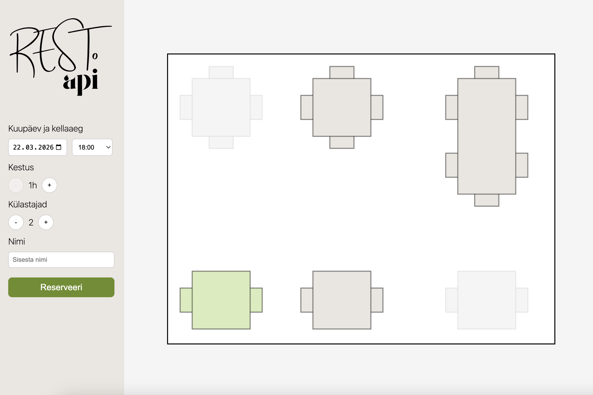

# RESTo API
Simple restaurant table reservation and recommendation system.

## Features
* View restaurant plan with all tables
* Filter tables by date, time, duration and number of guests
* Real-time table availability based on reservations
* Automatic table recommendation (best fit for party size)
* Create reservations with validation and feedback

## Tech stack
### Backend
* Java 25
* Spring Boot
* Spring Data JPA
* Uses H2 as the database

### Frontend
* React
* HTML5 Canvas for restaurant layout visualization
* CSS

## Prerequisites
* Java 25
* Node.js + npm
* Gradle
* An IDE or code editor (e.g., IntelliJ IDEA)


## Installation

### Backend (Spring Boot)
1. Clone the repository:
   ```bash
   git clone https://github.com/palllaura/restoapi.git
   cd restoapi

2. Open the project in your IDE.

3. Build and run the backend:
   ```bash
   ./gradlew bootRun
4. The backend server will start at:
   http://localhost:8080

### Frontend (React + Canvas)
1. Navigate to the frontend folder:
   ```bash
   cd frontend
2. Install dependencies:
   ```bash
   npm install
3. Start the development server:
   ```bash
   npm run dev
4. The frontend will be available at:
   http://localhost:5173

### Database (H2)
The database starts automatically when the backend application runs.
H2 console will be available at: http://localhost:8080/h2-console

## Assumptions
* Only full-hour bookings (no minute precision)
* Fixed table layout (no dynamic positioning)
* Recommendation is based only on table size (no user preferences yet)
* Opening hours: 10:00–22:00
* Reservations: 1–3h, up to 3 days ahead

## Notes
* Overlapping reservations are prevented
* Tables are marked as FREE / OCCUPIED / RECOMMENDED
* Demo data is generated automatically

## Future plans
* Table zones (terrace, indoor, private room)
* User preferences (window, quiet area, etc.)
* Smarter recommendation algorithm (scoring system)
* Combine tables for large groups
* Edit / cancel reservations
* Admin view for managing layout
* Docker support

## Screenshot

